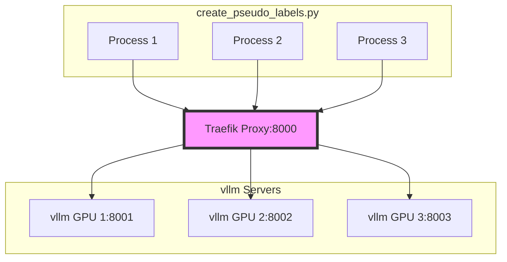

# Create Pseudo Labels Architecture
In order to utilize all computing resources, we use vllm to serve the language model with one process per GPU.

The frontend server is a traefik server that routes the requests to the backend vllm servers in a round-robin manner.

The python script will read the ultrachat files with one jsonl file per process. In every process, it will read the jsonl file, and send the messages to the vllm server in a multi-thread manner.

The diagram of the architecture is as follows:


# How to run Step by Step

1. Download the traefik binary from https://github.com/traefik/traefik/releases/tag/v3.1.4
Assume the traefik binary is downloaded and save to TRAEFIK_PATH.
```bash
export TRAEFIK_PATH=<path to the traefik binary>
```

2. Download the ultrachat files from https://huggingface.co/datasets/stingning/ultrachat
Assume the ultrachat files are downloaded and save to ULTRACHAT_PATH.
```bash
export ULTRACHAT_PATH=<path to the ultrachat files>
```

3. Assume we made pseudo labels for the ultrachat files with model id MODEL_ID.
```bash
export MODEL_ID=<model id>
```

4. Assume the RWKV-in-LLama is downloaded and save to RWKV_IN_LLAMA_PATH.
```bash 
export RWKV_IN_LLAMA_PATH=<path to the RWKV-in-LLama>
```

5. Run the following command to start the vllm servers:
```bash
cd $RWKV_IN_LLAMA_PATH
python3 train_scripts/create_vllm_servers.py -m $MODEL_ID -p 8001 -n 4 -l 16384
```

6. Start the traefik server
```bash
cp $TRAEFIK_PATH/traefik $RWKV_IN_LLAMA_PATH/traefik_files
cd $RWKV_IN_LLAMA_PATH/traefik_files
./traefik --configFile=traefik.yml
```

7. Run the following command to start the create_pseudo_labels_serving.py.
Assume the output directory is /home/yueyulin/data/ultrachat_pseudo_labels_llama31Instruct/ and export it to OUTPUT_PATH.
```bash
cd $RWKV_IN_LLAMA_PATH
python data/create_pseudo_labels_serving.py --data_dir $ULTRACHAT_PATH --output_dir $OUTPUT_PATH --from_percent 0.3 --to_percent 0.6 --num_devices 10
```

The from_percent and to_percent are the percentage of the ultrachat files that we want to make pseudo labels. This feature enables us to generate the pseudo labels in multiple machines and each machine can generate part of the pseudo labels.


Finally, we will get the pseudo labels in the $OUTPUT_PATH.
