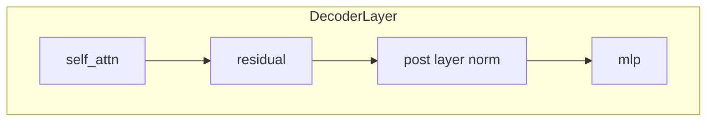
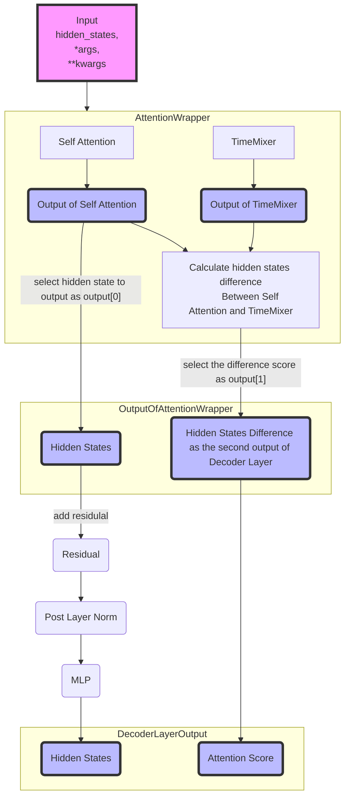

# 训练流程图

# Model Illustration

## Stage 1 - TimeMixer replacing Self-Attention

Original Decoder Layer:

Replace the Attention to an AttentionWrapper which includes the original self_attn and a TimeMixer, the TimeMixer will learn to close the gap between the output of self_attn and the output of TimeMixer. The final output consists of the hidden states of original self_attn and the difference between the output of self_attn and TimeMixer.  Model will optimize the TimeMixer to minimize the difference between the output of self_attn and TimeMixer.:

