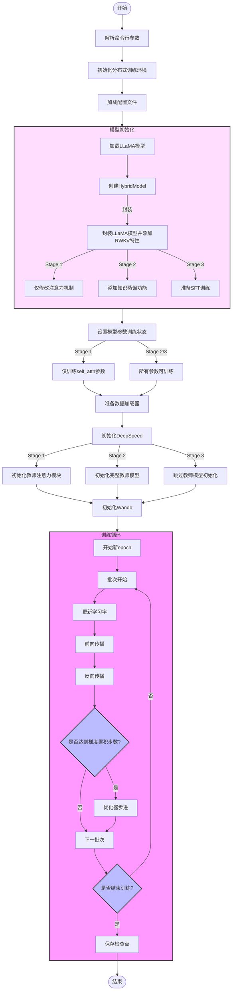

# 训练流程图

```mermaid
flowchart TB
    Start([开始]) --> ParseArgs[解析命令行参数]
    ParseArgs --> InitDistributed[初始化分布式训练环境]
    InitDistributed --> LoadConfig[加载配置文件]
    
    subgraph ModelInit[模型初始化]
        direction TB
        LoadLLM[加载LLaMA模型] --> InitHybrid[创建HybridModel]
        InitHybrid --> |封装| WrapModel[封装LLaMA模型并添加RWKV特性]
        WrapModel --> |Stage 1| Stage1[仅修改注意力机制]
        WrapModel --> |Stage 2| Stage2[添加知识蒸馏功能]
        WrapModel --> |Stage 3| Stage3[准备SFT训练]
    end
    
    LoadConfig --> ModelInit
    
    ModelInit --> SetModelParams[设置模型参数训练状态]
    SetModelParams --> |Stage 1| SetStage1[仅训练self_attn参数]
    SetModelParams --> |Stage 2/3| SetStage23[所有参数可训练]
    
    SetStage1 & SetStage23 --> PrepareData[准备数据加载器]
    PrepareData --> InitDeepSpeed[初始化DeepSpeed]
    
    InitDeepSpeed --> |Stage 1| InitTeacherAttn[初始化教师注意力模块]
    InitDeepSpeed --> |Stage 2| InitTeacherModel[初始化完整教师模型]
    InitDeepSpeed --> |Stage 3| SkipTeacher[跳过教师模型初始化]
    
    InitTeacherAttn & InitTeacherModel & SkipTeacher --> InitWandb[初始化Wandb]
    
    InitWandb --> TrainingLoop[进入训练循环]
    
    subgraph TrainingLoop[训练循环]
        direction TB
        EpochStart[开始新epoch] --> BatchStart[批次开始]
        BatchStart --> UpdateLR[更新学习率]
        UpdateLR --> Forward[前向传播]
        Forward --> Backward[反向传播]
        Backward --> CheckAccum{是否达到梯度累积步数?}
        CheckAccum --> |是| OptimStep[优化器步进]
        CheckAccum --> |否| NextBatch[下一批次]
        OptimStep --> NextBatch
        NextBatch --> CheckEnd{是否结束训练?}
        CheckEnd --> |否| BatchStart
        CheckEnd --> |是| SaveCheckpoint[保存检查点]
    end
    
    SaveCheckpoint --> End([结束])
    
    classDef process fill:#f9f,stroke:#333,stroke-width:2px;
    classDef condition fill:#bbf,stroke:#333,stroke-width:2px;
    classDef modelInit fill:#fdf,stroke:#333,stroke-width:2px;
    class CheckAccum,CheckEnd condition;
    class TrainingLoop process;
    class ModelInit modelInit;
```