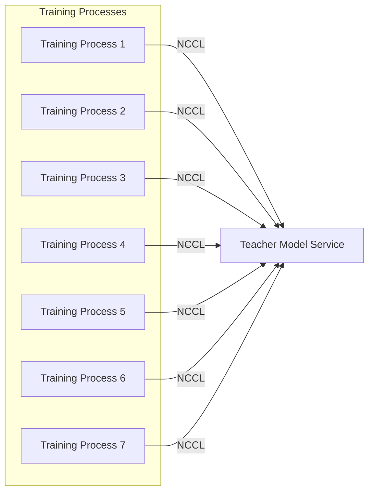
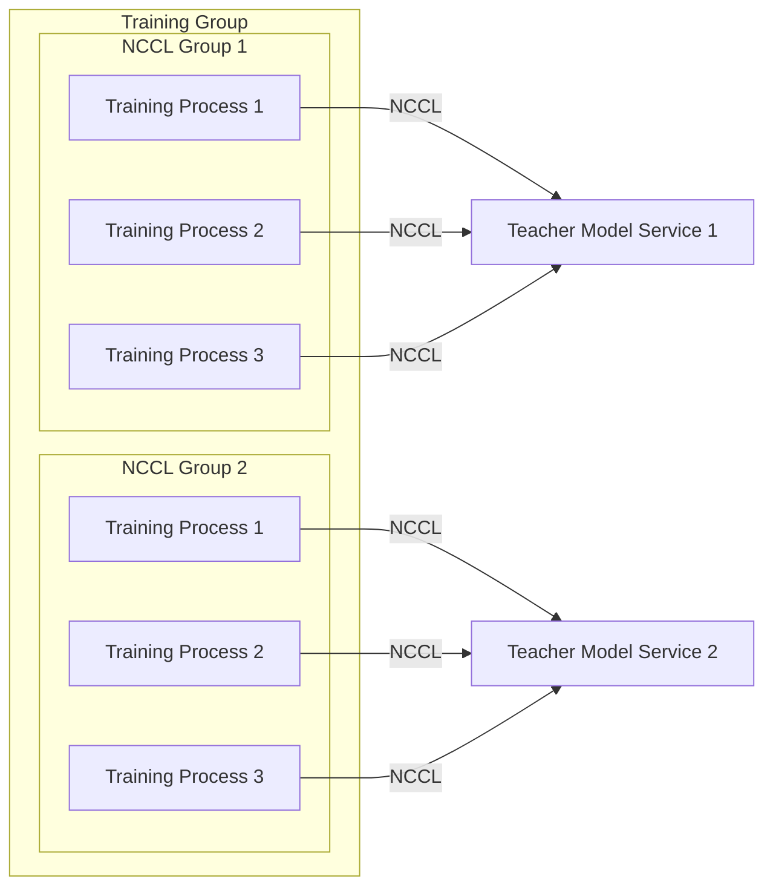

# RWKVinLLAMA

This repository is used to distill (hybrid) RWKV model with Llama. 

# Architecture

Since the teacher model is relatively large, we design a NCCL based service to run the teacher model in a separate card while other training processes just get the logits from the teacher model service through NCCL.

The following is one teacher serves multiple training processes.



The teacher model service is implemented in `server/teacher_server_nccl_gather.py'. 
We gather all input_ids from training processes and run inference in batch because NCCL transfer speed is much faster than the inference speed of the teacher model.

Further, we also implement multiple teacher model service to serve multiple groups of  training processes.
The following is the architecture of multiple teacher model service.



# Training steps


## Data preparation
In this repository, I tried two different datasets to run distillation.

- Ultrachat-200k

    This dataset is used to instruct the model to generate response. Run the  data/create_dataset.py to generate training data. The process is to mask the user's message in the label and then use the model to generate the response.
    The script looks like this:
    ```bash
    python data/create_dataset.py --tokenizer /path/to/llama3/8b --output_dir /path/to/output/dataset --max_len 2048
    ```
- C4
    The data/c4_datasets.py is to use C4 dataset to run distillation. The following codes show how to use en and zh dataset together to run distillation.
    ```python
    import argparse
    parser = argparse.ArgumentParser()
    parser.add_argument('--local_c4_dir', type=str, required=True, help='local c4 directory')
    parser.add_argument('--languages', type=str, nargs='+', default=['en', 'zh'], help='languages to interleave')
    parser.add_argument('--model_id', type=str, required=True, help='model id')
    args = parser.parse_args()

    local_c4_dir = args.local_c4_dir
    languages = args.languages
    combined_dataset = load_and_interleave_c4(local_c4_dir, languages,split='validation')
    print(combined_dataset)
    tokenizer = AutoTokenizer.from_pretrained(args.model_id)
    tokenizer.pad_token = tokenizer.eos_token
    collate_fn = data_collator(tokenizer, max_seq_length=2048)
    from torch.utils.data import DataLoader
    dataloader = DataLoader(combined_dataset, collate_fn=collate_fn, batch_size=16, shuffle=True)
    for batch in dataloader:
        print(batch)
        print(batch['input_ids'].shape)
        print(batch['labels'].shape)
        break
    ```

## Training scripts

### Start the teacher model service
If you want to use separate GPUs to run teache model service, please ensure all the GPUPs are on the same node since NCCL will use PCIe or local NVLink to transfer data between GPUs. 

The following commands is to start two teacher model service in a 8-GPU node. Thus two GPUs are used to run the teacher model service and the rest 6 GPUs are used to run training processes.
The whole 8 GPUs are divided into two NCCL groups to communicate the logits between the teacher model service. 
All six GPUs are used to run training processes.

```bash
python server/teacher_server_nccl_gather.py --model_id /data/rwkv/models/meta-llama/Meta-Llama-3.1-8B-Instruct/ --batch 3 --length 2048 --size 4 --output_all_hiddens --device_id 6 --nccl_id_file nccl.txt_0
```

```bash
python server/teacher_server_nccl_gather.py --model_id /data/rwkv/models/meta-llama/Meta-Llama-3.1-8B-Instruct/ --batch 3 --length 2048 --size 4 --output_all_hiddens --device_id 7 --nccl_id_file nccl.txt_1
```
The above commands ask the teacher model to return all hidden states. We follow the paper https://arxiv.org/pdf/2408.10189 to use stage-2 to align the hidden states between the teacher model and the student model.


### Train the student model

We support both end-to-end distillation and the hidden states alignment distillation. The following command is to run hidden states alignment distillation with c4 dataset.

```bash
python train_scripts/train_hybrid.py --max_epochs 3 --num_devices 6 --grad_cp 1 --max_seq_length 2048 --output_dir /data/rwkv/tmp/distill-c4-en-zh --config_file configs/test_hybrid_full_logits.yaml --lr_init 1e-4 --micro_bsz 3 --c4_data /data/rwkv/data/c4/ --dropout 0.01 --strategy deepspeed_stage_3_offload
```

Since most of the C4 dataset example length is less than 2048, we set the max_seq_length to 2048 to save VRAM.