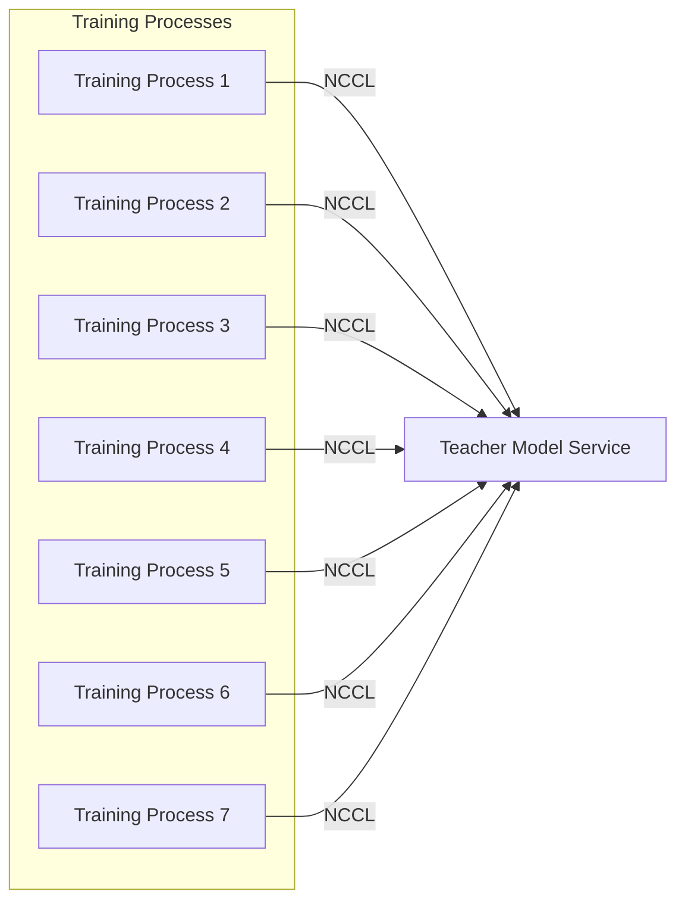

# RWKVinLLAMA

This repository is used to distill (hybrid) RWKV model with Llama. 

# Architecture

Since the teacher model is relatively large, we design a NCCL based service to run the teacher model in a separate card while other training processes just get the logits from the teacher model service through NCCL.

The teacher model service is implemented in `server/teacher_server_nccl_gather.py'. 
We gather all input_ids from training processes and run inference in batch because NCCL transfer speed is much faster than the inference speed of the teacher model.